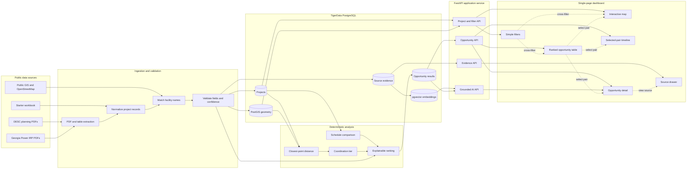

# Gridlock Intelligence Project Requirements and Architecture

## 1. Project summary

Gridlock Intelligence is a single-page analytics application that compares future construction plans from neighboring electric utilities and identifies cross-utility coordination opportunities.

The initial implementation compares:

- Dominion Energy South Carolina
- Georgia Power

The product combines public planning documents, project locations, geospatial analysis, construction schedules, and source evidence. It helps utility planners identify projects that are geographically close, active during similar periods, or both.

The application should be understandable to nontechnical engineers. Its interaction model should resemble a well-designed Power BI dashboard: familiar filters, linked visuals, plain-language explanations, and a simple drill-down into supporting evidence.

## 2. Project objectives

The application must help a user answer four questions quickly:

1. Where are both utilities' planned construction projects?
2. Which cross-utility project pairs satisfy the overlap criteria?
3. Why is one opportunity ranked above another?
4. What coordination actions should the utilities investigate?

The system should turn separate public filings into a traceable coordination workflow rather than merely plotting projects on a map.

## 3. Required challenge functionality

### 3.1 Source ingestion

The system must ingest publicly available future-construction information for at least two utilities.

Supported source types should include:

- Utility planning PDFs
- Integrated resource plans
- Transmission expansion plans
- Public regulatory filings
- Public project webpages
- Spreadsheet or CSV starter data
- Public GIS or OpenStreetMap data used to locate facilities

The application must not ingest or expose confidential or CEII-restricted information.

### 3.2 Project normalization

Each utility project should be converted into a common record containing, when available:

- Project identifier
- Utility
- Project name
- State
- Project type
- Voltage
- Status
- Planned construction start
- Planned in-service date
- Named endpoints
- Point, line, or polygon geometry
- Geometry method
- Geometry confidence
- Schedule confidence
- Source document
- Source page
- Source publication date
- Notes and limitations

### 3.3 Geographic overlap

Geographic proximity is the primary matching signal.

- Compare projects belonging to different utilities.
- Flag project pairs within 40 km or 25 miles.
- Use the closest points between project geometries whenever route geometry is available.
- If only project endpoints or center points are available, clearly label the result as an estimate.
- Store the two points used for the displayed distance measurement.
- Exclude pairs outside the selected distance threshold.

Coordination tiers:

| Distance | Interpretation |
| --- | --- |
| Touching or crossing | Operational coordination is likely required |
| Under 1.6 km | Potential shared right-of-way, access roads, land, or permitting |
| Under 8 km | Potential shared staging, deliveries, and site logistics |
| Under 40 km | Potential shared crews, contractors, and equipment |

These tiers identify subjects for investigation. They do not prove that resources, land, permits, or outages can be shared.

### 3.4 Timeline overlap

Timeline proximity is a secondary matching signal.

The system should:

- Compare construction start and completion or in-service dates.
- Detect whether two known construction windows overlap.
- Calculate the difference between planned in-service dates.
- Distinguish exact construction-window overlap from near-synchronous completion dates.
- Display insufficient schedule data rather than inventing dates.

### 3.5 Ranked opportunities

The application must provide a ranked list of cross-utility opportunities.

The ranking must be explainable and primarily deterministic. A suggested scoring structure is:

| Component | Maximum points |
| --- | ---: |
| Geographic proximity | 50 |
| Timeline alignment | 25 |
| Infrastructure compatibility | 15 |
| Data confidence | 10 |
| Total | 100 |

Physical crossings may receive an explicit priority override. AI may explain the score but must not calculate or silently modify the underlying spatial and schedule measurements.

### 3.6 Interactive presentation

The required user interface should include:

- Interactive project map
- Utility, year, voltage, distance, and view filters
- Compact summary metrics
- Ranked opportunity table
- Selected-pair timeline
- Selected-opportunity explanation
- Source and confidence drawer
- Visible data limitations

Map interactions must include pan, zoom, hover, selection, and synchronized highlighting between the map and opportunity table.

### 3.7 Bonus impact estimate

If implemented, cost or impact estimates must be scenario-based and transparent.

- Show editable assumptions.
- Present ranges rather than false precision.
- Label results as illustrative planning estimates.
- Do not claim confirmed savings.
- Keep the calculator secondary to the required map and ranked results.

## 4. User experience requirements

### 4.1 Primary user groups

- Transmission planners
- Construction and field-operations managers
- Engineering and reliability teams
- Permitting and right-of-way teams
- Regional planning coordinators

### 4.2 Simplicity requirements

- Use one primary dashboard.
- Do not require navigation between multiple analytics pages.
- Keep all essential analysis visible without training.
- Show no more than five primary filters.
- Use plain-language labels.
- Update all visuals together when a filter changes.
- Provide one clear Reset filters action.
- Show advanced methodology only on request.
- Use side panels or drawers for secondary details.
- Keep AI contextual and optional.

### 4.3 Recommended dashboard layout

```text
┌─────────────────────────────────────────────────────────────────────┐
│ Gridlock Intelligence                      Data updated Sep 2026    │
├─────────────────────────────────────────────────────────────────────┤
│ Utility [All]  Year [2024-2033]  Voltage [All]  Distance [40 km]   │
├─────────────────────────────────────────────────────────────────────┤
│ 10 Projects       6 Opportunities       2 Timeline Matches          │
├───────────────────────────────────────────┬─────────────────────────┤
│                                           │ Ranked opportunities    │
│                                           │                         │
│              Interactive map              │ 1 Jasper-Okatie         │
│                                           │   McIntosh-Purrysburg   │
│                                           │   9.1 km | 152 days     │
│                                           │                         │
├───────────────────────────────────────────┴─────────────────────────┤
│ Selected-pair timeline and explanation                             │
└─────────────────────────────────────────────────────────────────────┘
```

### 4.4 Primary filters

Use no more than these five visible filters:

1. Utility
2. Planned year
3. Voltage
4. Distance tier
5. Show all projects or coordination opportunities

### 4.5 Visual requirements

- Use a quiet, low-contrast basemap.
- Give each utility a stable color and redundant line or marker encoding.
- Use solid lines for official routes.
- Use dashed lines for inferred or endpoint-derived routes.
- Use a visible connector between the two measured points of a selected pair.
- Keep unrelated projects subdued after a pair is selected.
- Avoid large buffers around every project.
- Avoid decorative charts, gauges, or repeated metrics.
- Maintain accessible contrast and keyboard-visible focus states.

### 4.6 Plain-language terminology

Prefer:

- Projects close enough to coordinate
- Planned completion dates are 152 days apart
- Location is approximate
- Potential to share crews and equipment
- View source
- How this was calculated

Avoid exposing internal terminology such as temporal delta, entity-resolution vector, or retrieval-augmented generation in the primary interface.

## 5. Initial demonstration opportunity

The first demo should feature the strongest pair in the supplied workbook.

### 5.1 Dominion Energy South Carolina

- Project ID: DESC_3
- Project: Jasper-Okatie 230 kV Line No. 2
- Status: In progress
- Planned in-service: December 31, 2025
- Approximate length: 6.5 miles
- Jasper Substation: 32.359120, -81.124600
- Okatie Substation: 32.333758, -81.032495

### 5.2 Georgia Power

- Project ID: GPC_2
- Project: SAV: McIntosh-Purrysburg 230 kV Reactors
- Start date: January 1, 2024
- Need or in-service date: June 1, 2026
- McIntosh coordinate: 32.352116, -81.175112

### 5.3 Pair result

- Overlap ID: OVL_2
- Supplied center-point estimate: 5.65 miles or 9.09 km
- Difference between planned in-service dates: 152 days
- Construction activity overlaps
- Both projects involve 230 kV infrastructure
- Primary coordination category: crews and equipment
- Additional investigation: staging, deliveries, contractor mobilization, and outage planning

The current distance must be labeled as a center-point estimate until route geometry is calculated and verified.

## 6. Recommended technology stack

### Frontend

- React with TypeScript
- MapLibre GL JS or Leaflet
- Recharts or lightweight SVG for the timeline and distance-tier chart
- A small component library or restrained custom design system

### Backend

- Python
- FastAPI
- Pydantic for input and extraction validation
- Background ingestion task or explicit admin upload workflow

### Data processing

- PDF text and table extraction
- Structured LLM extraction for inconsistent document layouts
- Shapely or GeoPandas for ingestion-time geometry preparation
- Deterministic validation rules

### Database

- TigerData or another managed PostgreSQL service
- PostGIS for geometry, spatial indexes, closest-point distance, intersection, and buffer queries
- pgvector for grounded source retrieval if the AI brief is implemented

### AI

- Structured extraction from public documents
- Facility-name matching suggestions
- Data-quality explanations
- Grounded coordination-brief generation
- Natural-language conversion into safe dashboard filters

## 7. System architecture



## 8. Data model

### 8.1 Projects

```sql
CREATE EXTENSION IF NOT EXISTS postgis;
CREATE EXTENSION IF NOT EXISTS vector;

CREATE TABLE projects (
    id TEXT PRIMARY KEY,
    utility TEXT NOT NULL,
    state TEXT,
    project_name TEXT NOT NULL,
    project_type TEXT,
    voltage_kv INTEGER,
    status TEXT,
    planned_start DATE,
    in_service_date DATE,
    geometry GEOGRAPHY,
    geometry_method TEXT,
    geometry_confidence NUMERIC,
    schedule_confidence NUMERIC,
    source_document TEXT,
    source_page INTEGER,
    source_publication_date DATE,
    notes TEXT
);

CREATE INDEX projects_geometry_gix
ON projects USING GIST (geometry);
```

### 8.2 Opportunities

```sql
CREATE TABLE opportunities (
    id TEXT PRIMARY KEY,
    project_a_id TEXT NOT NULL REFERENCES projects(id),
    project_b_id TEXT NOT NULL REFERENCES projects(id),
    distance_meters NUMERIC NOT NULL,
    closest_point_a GEOGRAPHY,
    closest_point_b GEOGRAPHY,
    timeline_gap_days INTEGER,
    schedules_overlap BOOLEAN,
    coordination_tier TEXT,
    geographic_score NUMERIC,
    timeline_score NUMERIC,
    compatibility_score NUMERIC,
    confidence_score NUMERIC,
    opportunity_score NUMERIC,
    calculated_at TIMESTAMPTZ NOT NULL DEFAULT NOW()
);
```

### 8.3 Source evidence

```sql
CREATE TABLE source_chunks (
    id BIGSERIAL PRIMARY KEY,
    project_id TEXT REFERENCES projects(id),
    source_document TEXT NOT NULL,
    source_page INTEGER,
    content TEXT NOT NULL,
    embedding VECTOR
);
```

## 9. Core spatial query

The system should calculate pairs using full geometry when available:

```sql
SELECT
    a.id AS project_a_id,
    b.id AS project_b_id,
    ST_Distance(a.geometry, b.geometry) AS distance_meters,
    ST_ClosestPoint(a.geometry::geometry, b.geometry::geometry) AS closest_point_a,
    ST_ClosestPoint(b.geometry::geometry, a.geometry::geometry) AS closest_point_b
FROM projects a
JOIN projects b
  ON a.utility <> b.utility
 AND a.id < b.id
 AND ST_DWithin(a.geometry, b.geometry, 40000);
```

The production implementation must confirm appropriate PostGIS geography or projected-geometry handling before relying on closest-point output. Distance units displayed to users must always be explicit.

## 10. AI architecture and safeguards

### 10.1 Appropriate AI uses

- Extracting structured fields from inconsistent public documents
- Suggesting matches between differently named facilities
- Explaining validation warnings
- Turning natural-language requests into visible dashboard filters
- Generating coordination briefs grounded in selected project records and retrieved source passages

### 10.2 Deterministic responsibilities

AI must not own:

- Distance calculation
- Intersection detection
- Date arithmetic
- Threshold classification
- Final opportunity score
- Source provenance
- Confidentiality classification

### 10.3 Grounding rules

- Retrieve only evidence connected to the selected projects.
- Attach source document and page references.
- Separate observed facts from potential actions.
- State when geometry or schedules are approximate.
- Do not fabricate costs, routes, permissions, outages, or resource availability.
- Require human review before exporting or sharing a coordination brief.

## 11. API requirements

Suggested endpoints:

```text
GET  /api/projects
GET  /api/projects/{project_id}
GET  /api/opportunities
GET  /api/opportunities/{opportunity_id}
GET  /api/opportunities/{opportunity_id}/evidence
POST /api/opportunities/{opportunity_id}/brief
POST /api/query/filters
POST /api/admin/ingest
GET  /api/data-quality
```

Filter parameters should include utility, year range, voltage, maximum distance, confidence, and opportunities-only mode.

## 12. Nonfunctional requirements

### Performance

- Initial dashboard should become usable within three seconds on a typical broadband connection.
- Filter changes should update visible results within one second for the hackathon dataset.
- Spatial columns must be indexed.
- Repeated opportunity calculations may be materialized or cached.

### Reliability

- Validate every ingested project record.
- Preserve original source values separately from normalized values.
- Log ingestion and matching errors.
- Never silently replace a human-confirmed coordinate with an AI suggestion.

### Security and privacy

- Use public sources only.
- Do not ingest documents marked nonpublic or confidential.
- Store database credentials and model keys in environment variables.
- Restrict ingestion and correction endpoints to administrators.
- Sanitize document text before displaying it in the interface.

### Accessibility

- Do not rely on color alone.
- Provide keyboard access and visible focus states.
- Use accessible labels for map controls and charts.
- Maintain readable contrast.
- Provide a tabular alternative to map-only information.

### Explainability

- Every ranked opportunity must show its important scoring factors.
- Every normalized source field should be traceable to a document and page.
- Geometry and schedule confidence must be visible.
- Approximate results must never be presented as official routes or confirmed plans.

## 13. 36-hour implementation scope

### Must ship

- Load and normalize the supplied project dataset
- Interactive map for both utilities
- Cross-utility distance calculation
- 40 km filtering and distance tiers
- Timeline comparison
- Ranked opportunity table
- Selected-pair detail and timeline
- Source and confidence information
- Responsive single-page dashboard

### High-value additions

- One working PDF extraction demonstration
- Explainable opportunity score
- Grounded coordination brief for the top opportunity
- Data-quality summary
- One simple scenario-based impact estimate

### Defer

- User accounts and complex permissions
- Live collaboration
- Automated ingestion from every utility website
- Full workflow or ticket management
- Power-flow modeling
- Predictive construction-cost modeling
- Multi-agent orchestration
- Native mobile application
- Support for many utilities

## 14. Acceptance criteria

The project is ready for demonstration when:

1. Both utilities' projects appear on the same interactive map.
2. Cross-utility pairs within 40 km are identified.
3. The top opportunity is ranked and explained.
4. Selecting a table row highlights both projects on the map.
5. The timeline shows whether the selected pair has concurrent activity.
6. The dashboard can be filtered without technical knowledge.
7. The user can see whether geometry is official or approximate.
8. Project facts link back to public source evidence.
9. The AI brief contains citations and separates facts from suggestions.
10. The main demo can be completed in under three minutes.

## 15. Demo narrative

1. Show that the two utilities publish plans separately.
2. Open the dashboard with both utilities already visible.
3. Filter to coordination opportunities.
4. Select Jasper-Okatie and McIntosh-Purrysburg.
5. Show the estimated 9.1 km separation.
6. Show the overlapping activity and 152-day in-service gap.
7. Explain the deterministic ranking.
8. Open the source and confidence drawer.
9. Generate the grounded coordination brief.
10. End with the recommended human action: confirm geometry and schedule a joint planning review.

## 16. Guiding principle

AI handles messy interpretation and explanation. Transparent spatial calculations, schedule logic, provenance, validation, and human review support the decision.
